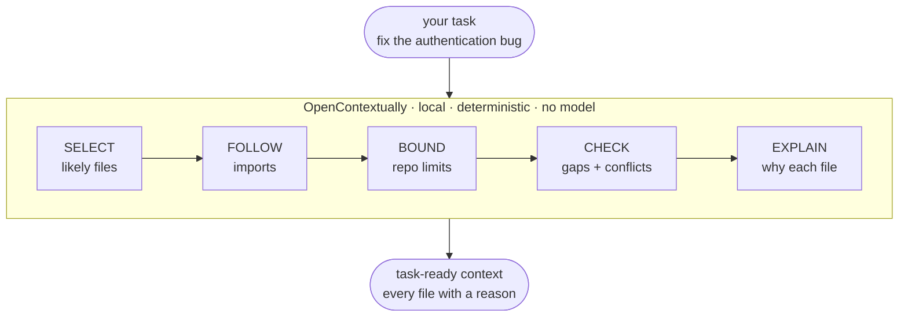

# OpenContextually

[](https://github.com/gammalex-ai/opencontextually/actions/workflows/test.yml)

**Give your coding agent the context it should read before it starts working.**

OpenContextually turns a task into a small, ranked, explainable context
package from your repository. It is not another coding agent — it is the
context layer before the agent.



**No model. No API key. No network. No database. No setup.** One dependency.
The same repository and task produce byte-identical output every time.

## What it looks like

```
gctx "fix the authentication bug"
```

Run from `examples/auth_bug/` — a small fixture with an auth module, a
config file, docs, and a test — this is the real, unedited output:

```
fix the authentication bug
6 relevant · 19 excluded

  src/auth/middleware.py  defines AuthenticationError
  README.md               defines authentication requirements
  tests/test_auth.py      imports middleware.py  ← via middleware.py
  config/auth.yaml        configuration referenced by authentication code
  docs/security.md        defines authentication requirements
  src/users/session.py    imported by middleware.py  ← via middleware.py

  ⚠ session.timeout_minutes: config/auth.yaml:3 declares 60 minutes, but docs/security.md:6 says 30 minutes
  ○ No test references session timeout minutes (config/auth.yaml:3)
  ○ No test references session expired (src/users/session.py:67)

  -v for code excerpts

Excluded: 19 files
  19 files scanned, not relevant enough

Checks run: configuration_discrepancy, test_reference_gap
```

Three things happened beyond ranking:

- **`session.py` was reached through an import, not through text.** It
  matches none of the task's words. `middleware.py` imports it, and the
  `← via` marker records that edge.
- **A config/doc disagreement was surfaced** — 60 minutes against 30.
- **Every file carries a reason,** and everything excluded is accounted for.

## Search finds matches. Context needs relationships.

Search answers *"where do these words occur?"*. That is a different
question from *"what should be read for this task?"*.

```
grep / ripgrep

  task ──────────────────►  keyword matches


OpenContextually

  task ──►  direct matches
                 │
                 ├──►  imported dependencies
                 ├──►  tests that exercise them
                 ├──►  relevant configuration
                 └──►  governing documentation
                              │
                              ▼
                     bounded context package
```

A task like `fix the authentication bug` can require a file that never
contains the words *authentication* or *bug*. OpenContextually starts from
direct relevance, follows Python's own import graph, applies repository
boundaries, runs two narrow deterministic checks, and explains every
inclusion.

Be honest about the split: relationship-following is the part search cannot
do at all, but most of the value on a typical run is ranking and
compression of files search *could* have found. Asking sqlfluff about
*"indentation rule fires on a templated line"*, a case-insensitive grep for
any of the task's words matches **415 files**; OpenContextually returns
**12**, each with a reason. Both numbers are reproducible from the corpus
below.

## Install

```
pip install -e .
```

Not yet on PyPI, so install from a clone. Python 3.10+.

## Using it

### CLI

| Command | What you get |
| --- | --- |
| `gctx "task"` | Ranked files, each with a reason |
| `gctx "task" -v` | Adds the code excerpt that justified each file |
| `gctx "task" --all` | Every included file, not just the top slice |
| `gctx "task" --json` | Full machine representation, for handing to an agent |
| `gctx "task" --root PATH` | Search somewhere other than the current directory |

`gctx` is short for *GammaLex Context*. The same command is also installed
as `octx` (the original name, kept working) and `opencontextually`. Flags
compose (`-v --all`); `--json` is unaffected by either and is always full
fidelity.

Write tasks the way you'd describe the bug. Naming a specific behavior or
symbol beats a directory-shaped noun.

### Python

```python
from opencontextually import get_context

package = get_context("fix the authentication bug")

print(package.render())     # the text above
package.to_dict()           # the same content as JSON
```

### MCP

Agents that speak [MCP](https://modelcontextprotocol.io) can call it
directly. Requires the optional extra:

```
pip install -e ".[mcp]"
```

Point your MCP client at the `opencontextually-mcp` command:

```json
{
  "mcpServers": {
    "opencontextually": {
      "command": "opencontextually-mcp"
    }
  }
}
```

It exposes exactly one tool — `get_context(task, root=".")` — returning the
same shape as `gctx --json`.

## Tested on real repositories

Scripted tests lock in fixes; they do not find them. Most real defects in
this project were found by running it against unfamiliar repositories and
reading the output, so a standing corpus is part of the project
(`benchmarks/`, with a runner that also checks determinism and sweeps for
leaked secrets).

### What it selected, and what it missed

Six of those repositories have a hand-checked answer key: the files that
actually implement or test the behaviour each task names, read out of the
project at its pinned commit. That makes selection quality measurable
rather than assertable.

| Repository | Files | Selected | Answer-key files found | In the default view |
| --- | ---: | ---: | ---: | ---: |
| httpx | 125 | 17 | 4/4 | 4/4 |
| requests | 128 | 16 | 4/4 | 4/4 |
| flask | 236 | 18 | 3/3 | 3/3 |
| click | 166 | 18 | 3/3 | 2/3 |
| sqlfluff | 5,955 | 18 | 2/2 | 1/2 |
| django | 7,085 | 18 | 2/3 | 2/3 |
| **Total** | | | **18/19** | **16/19** |

The second column is the one that matters to an agent. The compact output
shows eight files, so a file recovered at rank 17 was found but not
delivered — recall of the package is not recall of what gets read.

Across those six packages: **zero** fixture, vendor, generated or CI files
selected, **every** path inside the configured root, and **0.08%–1.6%** of
repository bytes delivered. sqlfluff's 5,249 test fixtures and django's 736
documentation files are excluded in full.

The remaining miss is honest and instructive. For *"queryset filter drops
the second condition"*, django's `contrib/admin/filters.py` — admin UI
list filters, the wrong subsystem entirely — takes rank 1, because it uses
the task's vocabulary more densely than the ORM does. `query_utils.py`,
where `Q` combines the conditions, is not selected at all. Term-rarity
weighting was tried and measured: it made other repositories worse. This
is tracked as [issue #6](https://github.com/gammalex-ai/opencontextually/issues/6)
and pinned by a regression test.

### The corpus

Ten public Python projects, each with a plausible task, all reproducible
with `benchmarks/dogfood.py`:

| Repository | Commit | Files | Time | Task |
| --- | --- | ---: | ---: | --- |
| [encode/httpx](https://github.com/encode/httpx) | [`b5addb64`](https://github.com/encode/httpx/commit/b5addb64f016) | 125 | 0.18s | redirect loses the authorization header |
| [psf/requests](https://github.com/psf/requests) | [`5460f467`](https://github.com/psf/requests/commit/5460f467b02e) | 128 | 0.12s | session cookie persists across redirects |
| [pallets/click](https://github.com/pallets/click) | [`36baa15f`](https://github.com/pallets/click/commit/36baa15ff831) | 166 | 0.25s | option prompt does not hide the input |
| [pallets/flask](https://github.com/pallets/flask) | [`d318b683`](https://github.com/pallets/flask/commit/d318b6834711) | 236 | 0.19s | session cookie is not set on redirect |
| [psf/black](https://github.com/psf/black) | [`8947c48e`](https://github.com/psf/black/commit/8947c48ef207) | 482 | 0.48s | string normalization changes the wrong quotes |
| [Textualize/rich](https://github.com/Textualize/rich) | [`9d8f9a37`](https://github.com/Textualize/rich/commit/9d8f9a372cc5) | 553 | 0.63s | table column width ignores the terminal size |
| [pydantic/pydantic](https://github.com/pydantic/pydantic) | [`f512b087`](https://github.com/pydantic/pydantic/commit/f512b087202f) | 824 | 1.70s | field validator not called on assignment |
| [fastapi/fastapi](https://github.com/fastapi/fastapi) | [`49033471`](https://github.com/fastapi/fastapi/commit/49033471594e) | 3,139 | 2.11s | dependency override not applied in nested routers |
| [sqlfluff/sqlfluff](https://github.com/sqlfluff/sqlfluff) | [`642e2e4a`](https://github.com/sqlfluff/sqlfluff/commit/642e2e4a34a8) | 5,955 | 2.18s | indentation rule fires on a templated line |
| [django/django](https://github.com/django/django) | [`73cc09f1`](https://github.com/django/django/commit/73cc09f14f13) | 7,085 | 7.52s | queryset filter drops the second condition |

All ten are MIT- or BSD-licensed public projects, unaffiliated with this
one, chosen for a spread of size and layout rather than for flattering
results. Each was cloned with `--depth 1` on 2026-08-30 at the commit
above; file counts and timings are specific to those commits.

18,693 files in total. **Zero secret-shaped strings** reached any package,
and every result was **byte-identical across repeat runs**. Times are
best-of-three on an M-series Mac running Python 3.13 with a warm page
cache; treat them as orders of magnitude, not a benchmark.

A caveat on the file counts, because the honest number is smaller than the
flattering one: these are *all* files in a clone. What actually gets read
is what survives your ignore rules, and on a repository with heavy build
output that is a small fraction. A 42,000-file checkout completing in two
seconds sounds impressive and mostly means 41,000 files were gitignored and
never opened. Of the 18,693 files above, 16,331 are actually scanned;
django's real figure is 5,580 files in 7.5 seconds.

Speed is listed last on purpose. It is a property worth keeping, not the
claim — a tool that walks a repository quickly and hands an agent the wrong
eight files has not helped anyone.

For `gctx "option prompt does not hide the input"` against click, the top
three are `core.py` (*defines Option*), `decorators.py` (*defines option*),
and `termui.py` (*defines `_mask_hidden_input`*) — the third being a private
helper whose name no part of the task literally matches.

## What it deliberately does not do

- **Follow imports outside Python.** Expansion uses the stdlib `ast`
  module; other languages get lexical matching only.
- **Understand your code.** Ranking is lexical scoring plus import
  expansion. It is weakest when your task's words are also the repo's
  naming convention — asking about "the context agent" where many files are
  named `*context*` — because filename matches then dominate.
- **Find problems for you.** The two checks are narrow, named rules that
  expect to stay quiet: they flag *detectable* gaps and conflicts —
  a config value contradicting a documented one, a config key or symbol no
  test references — not arbitrary missing context. Across the six
  answer-key corpus tasks they produced **zero** findings, which is the
  honest scope: they fire on the patterns they name, and `examples/` is
  where you can watch them do it. Across eleven real repositories, one
  produced a false positive (since fixed) — the honest measure of how much
  "high precision" has actually been tested. Silence is the normal outcome;
  a footer always names which checks ran.
- **Guarantee secrets stay out of excerpts.** Redaction masks
  secret-shaped keys and high-entropy strings, but it is best-effort
  pattern matching, not a secrets scanner. See [SECURITY.md](SECURITY.md).

## Scope, determinism, and safety

Discovery reads everything under `--root` minus what git already ignores —
honoring nested `.gitignore` files, `.git/info/exclude`, and the global
`core.excludesFile`, plus an optional `.opencontextuallyignore`. All
resolved without shelling out to git, so it works in directories that
aren't repositories at all.

Runs are deterministic: the same task and repository produce byte-identical
output, which is asserted in the test suite and re-checked by the corpus
runner. Nothing is written anywhere, and no network call is ever made.

## License

MIT
