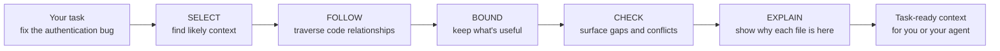

# OpenContextually

[](https://github.com/gammalex-ai/opencontextually/actions/workflows/test.yml)

**Give your coding agent the context it should read before it starts working.**

OpenContextually turns a task into a small, ranked, explainable context
package from your repository. It is not another coding agent — it is the
context layer before the agent.



**No model. No API key. No network. No database. No setup.** One dependency.
The same repository and task produce byte-identical output every time.

## What it looks like

```
gctx "fix the authentication bug"
```

Run from `examples/auth_bug/` — a small fixture with an auth module, a
config file, docs, and a test — this is the real, unedited output:

```
fix the authentication bug
6 relevant · 21 excluded

  src/auth/middleware.py  defines AuthenticationError
  src/users/session.py    imported by middleware.py  ← via middleware.py
  tests/test_auth.py      imports middleware.py  ← via middleware.py
  README.md               defines authentication requirements
  config/auth.yaml        configuration referenced by authentication code
  docs/security.md        defines authentication requirements

  ⚠ session.timeout_minutes: config/auth.yaml:3 declares 60 minutes, but docs/security.md:6 says 30 minutes
  ○ No test references session timeout minutes (config/auth.yaml:3)
  ○ No test references session expired (src/users/session.py:67)

  -v for code excerpts

Excluded: 21 files
  21 files scanned, not relevant enough

Checks run: configuration_discrepancy, test_reference_gap
```

Three things happened beyond ranking:

- **`session.py` was reached through an import, not through text.** It
  matches none of the task's words. `middleware.py` imports it, and the
  `← via` marker records that edge.
- **A config/doc disagreement was surfaced** — 60 minutes against 30.
- **Every file carries a reason,** and everything excluded is accounted for.

## Search finds matches. Context needs relationships.

Search answers *"where do these words occur?"*. That is a different
question from *"what should be read for this task?"*.

```
grep / ripgrep

  task ──────────────────►  keyword matches


OpenContextually

  task ──►  direct matches
                 │
                 ├──►  imported dependencies
                 ├──►  tests that exercise them
                 ├──►  relevant configuration
                 └──►  governing documentation
                              │
                              ▼
                     bounded context package
```

A task like `fix the authentication bug` can require a file that never
contains the words *authentication* or *bug*. OpenContextually starts from
direct relevance, follows Python's own import graph, applies repository
boundaries, runs two narrow deterministic checks, and explains every
inclusion.

Be honest about the split: relationship-following is the part search cannot
do at all, but most of the value on a typical run is ranking and
compression of files search *could* have found. Asking sqlfluff about
*"indentation rule fires on a templated line"*, a case-insensitive grep for
any of the task's words matches **415 files**; OpenContextually returns
**12**, each with a reason. Both numbers are reproducible from the corpus
below.

## Install

```
pip install -e .
```

Not yet on PyPI, so install from a clone. Python 3.10+.

## Using it

### CLI

| Command | What you get |
| --- | --- |
| `gctx "task"` | Ranked files, each with a reason |
| `gctx "task" -v` | Adds the code excerpt that justified each file |
| `gctx "task" --all` | Every included file, not just the top slice |
| `gctx "task" --json` | Full machine representation, for handing to an agent |
| `gctx "task" --root PATH` | Search somewhere other than the current directory |

`gctx` is short for *GammaLex Context*. The same command is also installed
as `octx` (the original name, kept working) and `opencontextually`. Flags
compose (`-v --all`); `--json` is unaffected by either and is always full
fidelity.

Write tasks the way you'd describe the bug. Naming a specific behavior or
symbol beats a directory-shaped noun.

### Python

```python
from opencontextually import get_context

package = get_context("fix the authentication bug")

print(package.render())     # the text above
package.to_dict()           # the same content as JSON
```

### MCP

Agents that speak [MCP](https://modelcontextprotocol.io) can call it
directly. Requires the optional extra:

```
pip install -e ".[mcp]"
```

Point your MCP client at the `opencontextually-mcp` command:

```json
{
  "mcpServers": {
    "opencontextually": {
      "command": "opencontextually-mcp"
    }
  }
}
```

It exposes exactly one tool — `get_context(task, root=".")` — returning the
same shape as `gctx --json`.

## Tested on real repositories

Scripted tests lock in fixes; they do not find them. Most real defects in
this project were found by running it against unfamiliar repositories and
reading the output, so a standing corpus is part of the project
(`benchmarks/`, with a runner that also checks determinism and sweeps for
leaked secrets).

Measured against public Python projects with different layouts and
documentation conventions:

| Repository | Files | Time | Included | Secrets leaked |
| --- | --- | --- | --- | --- |
| [click](https://github.com/pallets/click) | 166 | 0.23s | 18 | 0 |
| [flask](https://github.com/pallets/flask) | 236 | 0.17s | 18 | 0 |
| [sqlfluff](https://github.com/sqlfluff/sqlfluff) | 5,955 | 1.72s | 12 | 0 |

Larger private repositories in the corpus run ~42,000 files in about two
seconds.

For `gctx "option prompt does not hide the input"` against click, the top
three are `core.py` (*defines Option*), `decorators.py` (*defines option*),
and `termui.py` (*defines `_mask_hidden_input`*) — the third being a private
helper whose name no part of the task literally matches.

## What it deliberately does not do

- **Follow imports outside Python.** Expansion uses the stdlib `ast`
  module; other languages get lexical matching only.
- **Understand your code.** Ranking is lexical scoring plus import
  expansion. It is weakest when your task's words are also the repo's
  naming convention — asking about "the context agent" where many files are
  named `*context*` — because filename matches then dominate.
- **Find problems for you.** The two checks are narrow, named rules that
  expect to stay quiet. Across eleven real repositories, one produced a
  false positive (since fixed) — the honest measure of how much "high
  precision" has actually been tested. Silence is the normal outcome; a
  footer always names which checks ran.
- **Guarantee secrets stay out of excerpts.** Redaction masks
  secret-shaped keys and high-entropy strings, but it is best-effort
  pattern matching, not a secrets scanner. See [SECURITY.md](SECURITY.md).

## Scope, determinism, and safety

Discovery reads everything under `--root` minus what git already ignores —
honoring nested `.gitignore` files, `.git/info/exclude`, and the global
`core.excludesFile`, plus an optional `.opencontextuallyignore`. All
resolved without shelling out to git, so it works in directories that
aren't repositories at all.

Runs are deterministic: the same task and repository produce byte-identical
output, which is asserted in the test suite and re-checked by the corpus
runner. Nothing is written anywhere, and no network call is ever made.

## License

MIT
